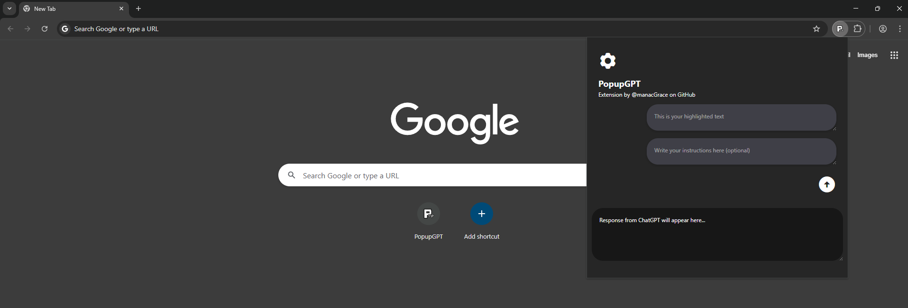
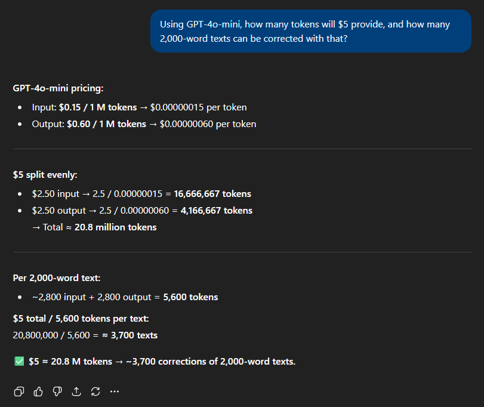
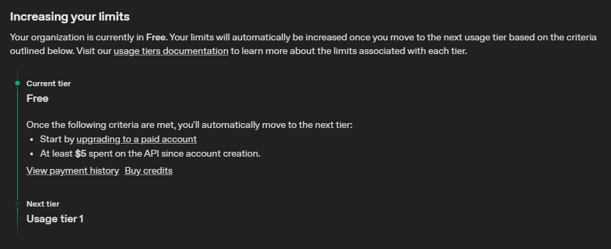
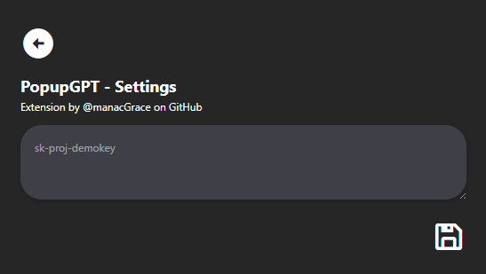

# PopupGPT

**A powerful browser extension that brings ChatGPT's writing assistance directly to your popup!**

---

## Features

- 🎯 **Instant Grammar Correction** - Get real-time writing assistance from ChatGPT
- ⚡ **Lightning Fast** - Quick popup interface
- 🎨 **Beautiful UI** - Dark-themed interface from ChatGPT's website
- 🔒 **Secure** - Your API key is stored locally in your browser
- 💰 **Free to Use** - Works with OpenAI API's  free tier (up to $5 in credits)
- 📝 **Custom Instructions** - Add specific instructions for your writing needs

---

## Screenshots

*Clean, modern interface with loading animations*

---

## Quick Start

### 1. Install the Extension

1. Download or clone this repository
2. Open Chrome and go to `chrome://extensions/`
3. Enable "Developer mode" in the top right
4. Click "Load unpacked" and select the PopupGPT folder

### 2. Get Your Free OpenAI API Key

#### Step 1: Create OpenAI Account
- Visit [OpenAI's API Platform](https://platform.openai.com/)
- Sign in or create a new account
- Set up an organization

#### Step 2: Skip Billing Setup (Important!)
As an organization, you get **$5 in free credits**, enough to correct approximately **3,700 full 2000-word texts**, using GPT-4o-mini!

#### Step 3: Create API Key
- Go to [API Keys page](https://platform.openai.com/api-keys)
- Click **"Create new secret key"**
- Name it something descriptive (e.g., "PopupGPT")
- **Copy the key immediately** - you won't see it again!

#### Step 4: Configure Extension
- Click the ⚙️ settings icon in the popup
- Paste your API key in the options page and save it

### 3. Start Writing!

You're all set! Now you can:
- Copy and paste the text you want to correct
- Add custom instructions if needed
- Send it to ChatGPT for correction!

---

## How It Works

1. **Text Selection** - Automatically detects highlighted text from any webpage
2. **Smart Processing** - Sends your text to ChatGPT with grammar correction instructions
3. **Instant Results** - Returns corrected text with improved grammar and clarity
4. **Custom Instructions** - Optionally add specific writing requirements

---

## Use Cases

- **Email Writing** - Perfect your professional communications
- **Content Creation** - Improve blog posts and articles
- **Business Writing** - Enhance reports and proposals
- **Academic Writing** - Polish essays and research papers
- **Social Media** - Craft engaging posts and comments

---

## Technical Details

- **Model**: GPT-4o-mini (fast and cost-effective)
- **Storage**: Local browser storage for API key security
- **Framework**: Vanilla JavaScript with modern CSS
- **Styling**: Tailwind CSS for responsive design

---

## Upcoming Features

- **Auto Text Detection** - Automatically detects and fills highlighted text from any webpage
- **Usage Analytics** - Track your writing improvements over time
- **Theme Customization** - Light/dark mode and custom color schemes
- **GPT Model Selection** - Choose the AI model you want to use (GPT-4, GPT-3.5, etc.) 

---

## License

This project is licensed under the MIT License - see the [LICENSE](LICENSE) file for details.

---

## Author

**@manacGrace** on GitHub

---

**⭐ Star this repository if you find it helpful!**

